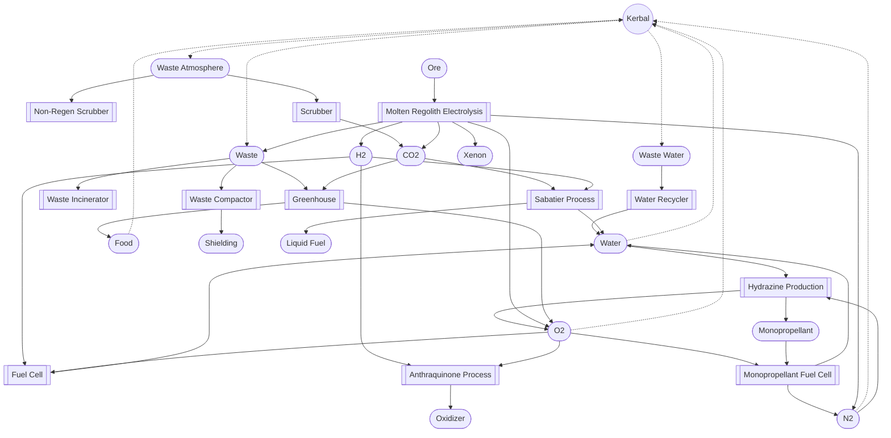

```mermaid
graph TD
    Kerbal((Kerbal))

    O2([O2])
    WasteAtmosphere([Waste Atmosphere])
    CO2([CO2])
    N2([N2])
    H2([H2])
    Water([Water])
    WasteWater([Waste Water])
    Food([Food])
    Waste([Waste])
    Shielding([Shielding])
    Ore([Ore])
    Monopropellant([Monopropellant])
    LiquidFuel([Liquid Fuel])
    Oxidizer([Oxidizer])
    Xenon([Xenon])

    O2 -.-> Kerbal
    N2 -.-> Kerbal
    Water -.-> Kerbal
    Food -.-> Kerbal
    Kerbal -.-> WasteAtmosphere
    Kerbal -.-> WasteWater
    Kerbal -.-> Waste

    NonRegenScrubber[[Non-Regen Scrubber]]
    WasteAtmosphere --> NonRegenScrubber

    Scrubber[[Scrubber]]
    WasteAtmosphere --> Scrubber
    Scrubber --> CO2

    WaterRecycler[[Water Recycler]]
    WasteWater --> WaterRecycler
    WaterRecycler --> Water

    WasteIncinerator[[Waste Incinerator]]
    Waste --> WasteIncinerator

    WasteCompactor[[Waste Compactor]]
    Waste --> WasteCompactor
    WasteCompactor --> Shielding

    FuelCell[[Fuel Cell]]
    H2 --> FuelCell
    O2 --> FuelCell
    FuelCell --> Water

    MonopropFuelCell[[Monopropellant Fuel Cell]]
    O2 --> MonopropFuelCell
    Monopropellant --> MonopropFuelCell
    MonopropFuelCell --> Water
    MonopropFuelCell --> N2

    HydrazineProduction[[Hydrazine Production]]
    Water --> HydrazineProduction
    N2 --> HydrazineProduction
    HydrazineProduction --> O2
    HydrazineProduction --> Monopropellant

    Anthraquinone[[Anthraquinone Process]]
    H2 --> Anthraquinone
    O2 --> Anthraquinone
    Anthraquinone --> Oxidizer

    Sabatier[[Sabatier Process]]
    CO2 --> Sabatier
    H2 --> Sabatier
    Sabatier --> LiquidFuel
    Sabatier --> Water

    MRE[[Molten Regolith Electrolysis]]
    Ore --> MRE
    MRE --> O2
    MRE --> CO2
    MRE --> H2
    MRE --> N2
    MRE --> Xenon
    MRE --> Waste

    Greenhouse[[Greenhouse]]
    Waste --> Greenhouse
    CO2 --> Greenhouse
    Greenhouse --> Food
    Greenhouse --> O2
```
